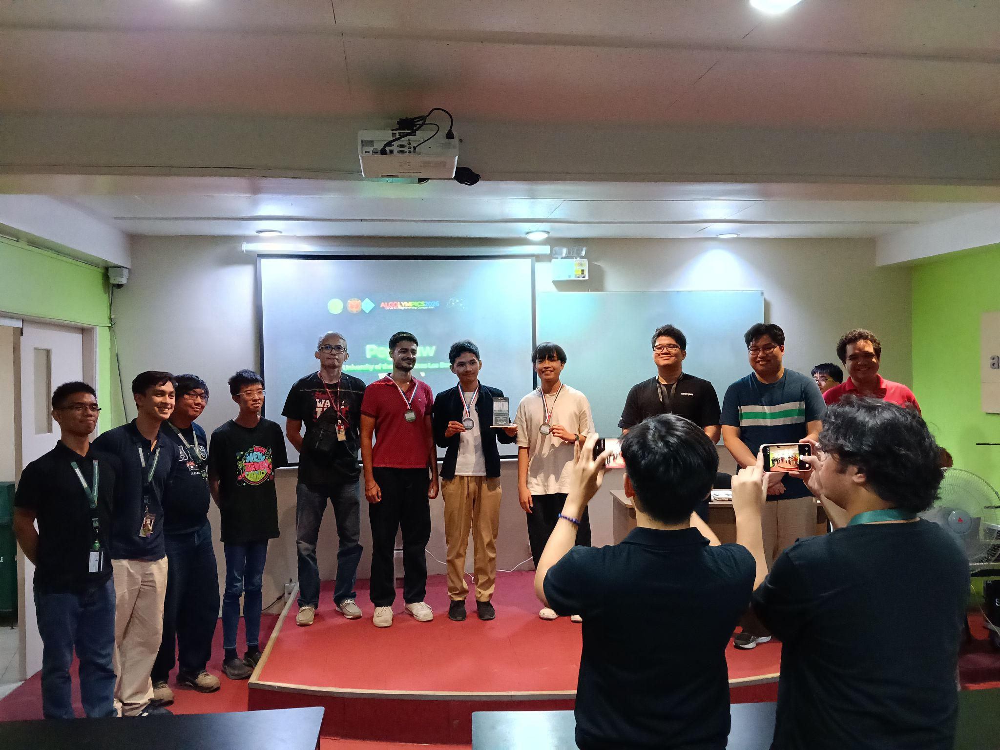
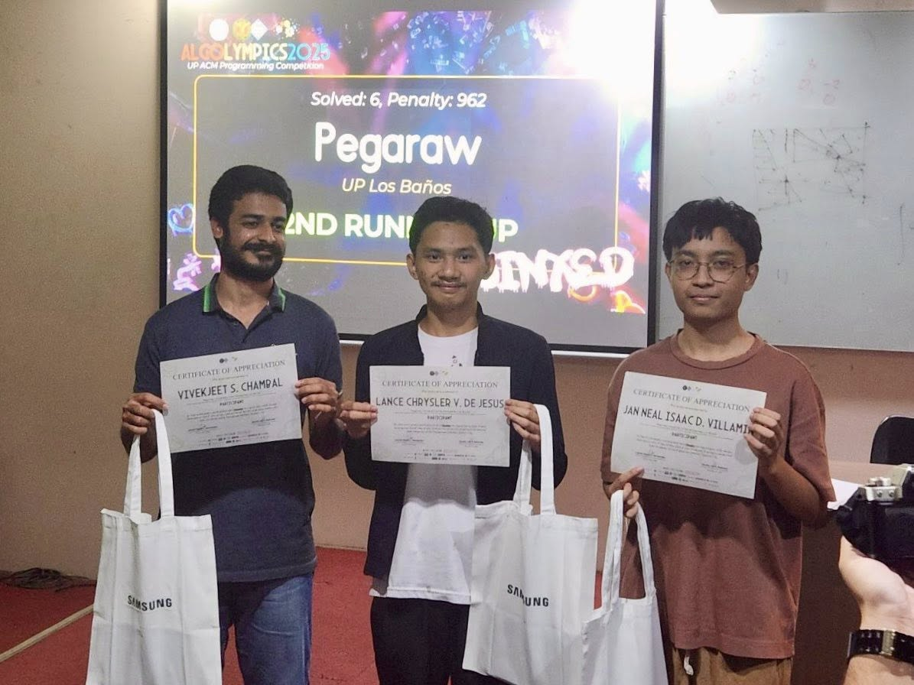
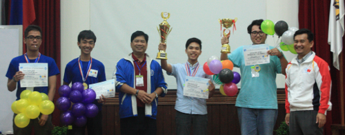

Achievements
############

:category: Pages
:date: 2026-05-03

*  **[2nd Place]** 2026 Algolympics **[Vivekjeet Chambal, Lance Chrysler De Jesus, Jan Neal Isaac Villamin, Coach: JACH]**

*  **[Third Place]** 2025 Algolympics **[Vivekjeet Chambal, Lance Chrysler De Jesus, Jan Neal Isaac Villamin, Coach: Perico Dionisio, Mira Arguelles]**

*  **[First Place][Top Performing School][Top Performing Coach]** 2016 Association for Computing Machinery International Collegiate Programming Competition (ACM-ICPC) Philippines Southern Luzon Invitational Programming Contest **[David Joshua Manalo, Ken Mercado, Anton Rufino, Coach: Clinton Poserio]**

